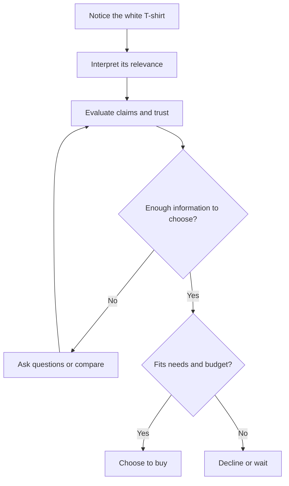

# Chapter 1: Persuasion and the Plain White T-Shirt

Imagine a plain white T-shirt on a table. Now picture that same shirt in three advertisements: folded beside everyday jeans, photographed in a spare gallery-like space, or worn by members of a campus club. The fabric, cut, and stitching stay exactly the same. What changes is the invitation to see it as useful, stylish, or connected to belonging.

That is where persuasion enters design. **Persuasion is an attempt to influence what someone notices, believes, values, or chooses through communication.** It can offer reasons, evoke feelings, or make relevant information easier to understand. It cannot guarantee agreement.

All T-shirt advertisements and situations in this chapter are hypothetical teaching examples, not claims about an actual product or research findings.

## What Persuasion Helps Shape

Persuasion reaches beyond the final “Buy” button. A designer makes choices that can influence four parts of a decision:

- **Attention:** What stands out? A large photograph might draw your eye to the shirt before its price.
- **Interpretation:** What does it mean? “Your everyday starting point” presents simplicity as practical; “Space for your own style” presents it as expressive.
- **Trust:** What deserves belief? Clear measurements and genuine customer photographs give you something to evaluate beyond a polished advertisement.
- **Action:** What happens next? You might check the size guide, compare another shirt, buy, or decide you do not need one.

These are connected questions, not a fixed sequence inside everyone's head. Someone may notice the price first, distrust a claim, and return to look for evidence.

A useful design supports the whole journey, including the decision to decline.

## Persuasion, Manipulation, and Coercion

These terms describe different ways of influencing a choice. Here is a practical ethical distinction:

| Approach | How it works | White T-shirt example |
| --- | --- | --- |
| Persuasion that respects choice | Gives understandable reasons or meaningful appeals while preserving informed refusal. | Shows styling possibilities alongside accurate material details and the full price. |
| Manipulation | Steers people through deception, hidden information, or exploitation of vulnerabilities. | Displays a countdown that secretly restarts, suggesting a deadline that does not exist. |
| Coercion | Uses force or threats to make refusal costly or unsafe. | A supervisor threatens to cut someone's shifts unless they buy the shirt. |

Persuasion is not automatically ethical, and these categories can overlap. An emotional story can respect someone's judgment; a technically true sentence can still mislead when crucial information is hidden. Ask whether the person can understand the offer and freely refuse it.

## Cialdini's Principles of Influence

Psychologist Robert Cialdini's framework originally described six major principles: reciprocity, commitment and consistency, social proof, authority, liking, and scarcity. These describe tendencies that can influence decisions, not buttons that control everyone. See his organization's [overview of the principles](https://www.influenceatwork.com/7-principles-of-persuasion/).

Cialdini later added **unity**: influence associated with a shared identity, or feeling that someone is “one of us.” This differs from simply liking someone. His [conversation with Jennifer L. Eberhardt](https://www.psychologicalscience.org/observer/universal-principles-of-influence) explains the expanded framework.

The mechanisms below summarize the principles; the applications and cautions are hypothetical design examples.

| Principle | Mechanism | Ethical use with the shirt | Misuse risk |
| --- | --- | --- | --- |
| Reciprocity | Receiving a benefit can motivate returning one. | Offer a useful clothing-care guide without requiring a purchase. | Treating a free guide as a debt the reader owes. |
| Commitment and consistency | People often try to align choices with earlier voluntary commitments. | Help someone who chose a simpler wardrobe assess whether this shirt fits that goal. | Using a small earlier agreement to pressure an unwanted purchase. |
| Social proof | Others' choices can guide us, especially when we are uncertain. | Show authentic buyer reviews, including fit complaints. | Fabricating reviews or concealing relevant negative experiences. |
| Authority | Relevant, credible expertise can guide judgment. | Include a qualified textile specialist's actual assessment, with sponsorship disclosed. | Presenting celebrity fame as evidence of fabric expertise. |
| Liking | We are more receptive to people we like. | Let a friendly presenter demonstrate ways to wear the shirt. | Faking friendship to discourage critical questions. |
| Scarcity | Limited availability can increase perceived desirability. | Report genuinely limited stock accurately. | Inventing shortages or a false deadline. |
| Unity | Shared identity can make an appeal more influential. | With permission, show how an actual campus club styles the shirt. | Suggesting that buying proves someone is a real group member. |

Keep the distinctions clear. Social proof asks what other people are doing. Authority asks what a relevant expert knows. Unity asks who belongs to a shared “we.” None establishes that the shirt meets a particular buyer's needs.

## Two More Useful Ideas

### Framing: What Does the Same Information Emphasize?

**Framing** concerns how a choice is presented. Different descriptions of the same underlying option can lead people to evaluate it differently. Daniel Kahneman discusses framing and its development with Amos Tversky in his [Nobel Prize autobiographical account](https://www.nobelprize.org/prizes/economic-sciences/2002/kahneman/biographical/).

For a design exercise, keep the shirt, price, and purchase terms constant. Change only the words and imagery:

| Frame | Hypothetical headline and presentation | Meaning it invites |
| --- | --- | --- |
| Everyday usefulness | “Start with simple.” Show the shirt with several existing outfits. | A practical wardrobe option. |
| Personal expression | “Make it yours.” Show different people styling the identical shirt. | A starting point for individuality. |
| Belonging | “One shirt, many members.” Show consenting club members wearing it. | A shared visual connection. |

These are possible interpretations, not guaranteed responses. A gallery-style photograph might suggest refinement to one viewer and unnecessary expense to another.

Framing selects an angle; it does not create new product facts. Calling the shirt organic, unusually durable, or ethically manufactured requires evidence. Green scenery cannot supply that evidence. A useful frame helps someone recognize relevance while keeping important facts visible.

### Loss Aversion: What Might I Give Up?

**Loss aversion** describes the tendency for losses to weigh more heavily than comparable gains relative to a reference point. It is associated with Kahneman and Tversky's prospect theory; Kahneman also discusses it in the [same autobiographical account](https://www.nobelprize.org/prizes/economic-sciences/2002/kahneman/biographical/). Its strength depends on the situation; avoid treating it as a universal numerical rule.

Imagine a genuine offer reducing this shirt's price from $20 to $15 until Friday. “Save $5” emphasizes a gain. “Don't lose your $5 discount” emphasizes giving something up. The shirt and offer are identical, but the second wording encourages the reader to treat the discount as something already theirs.

Notice how concepts can overlap: a real deadline involves scarcity, while wording about losing the discount invokes loss aversion. Neither makes the purchase worthwhile by itself. Spending $15 on an unwanted shirt is still spending $15.

## Ethics Belongs in the Design

Evaluate the whole experience, not just whether each sentence is literally true. A prominent low price with unavoidable fees hidden until checkout can create a misleading impression. A visible purchase button paired with an almost invisible decline option undermines meaningful choice.

Make costs, limitations, and sponsorship understandable. Avoid pressure based on body insecurity or fear of social exclusion. Use readable text and clear controls so people can actually access the information you claim to provide.

Success should include whether people understood the offer and remained satisfied afterward. More purchases alone cannot tell you whether a design helped people make good decisions.

## Questions to Ask Before Trying to Persuade

1. What action am I encouraging, and how could it benefit this person?
2. What needs, budget limits, or vulnerabilities might matter here?
3. Which claims can I support, and what could the imagery imply without evidence?
4. What important costs, alternatives, or limitations might someone miss?
5. Are reviews, credentials, community connections, and deadlines authentic?
6. Can someone refuse, compare, or change their mind without shame or obstruction?
7. How would I find out whether people understood the offer, beyond counting purchases?

For the white T-shirt, these questions might lead to a modest conclusion: the most helpful message is that it suits certain outfits, with clear sizing information. Persuasion does not require turning every ordinary object into a life-changing promise.

## Explore Further

These are **suggestions for external research**, not additional evidence established by this chapter. Search your library catalog or a scholarly search service for:

- **Robert Cialdini, Influence, reciprocity, and unity:** Compare explanations of the original six principles with the expanded seven-principle framework.
- **Amos Tversky Daniel Kahneman framing of decisions:** Look for research that holds outcomes constant while changing their presentation.
- **Prospect theory loss aversion reference points:** Explore why what counts as a loss depends on the starting point someone uses.
- **Persuasive design informed choice dark patterns:** Compare designs that clarify choices with those that obstruct refusal.

Check who produced each source, what evidence it offers, and whether its findings apply to the audience and situation you are designing for.

## What You Should Remember

- Persuasion can shape attention, interpretation, trust, and action while leaving room for disagreement.
- Cialdini's seven principles explain common influences; they do not guarantee a response or justify pressure.
- Framing and loss aversion help explain why the same offer can feel different when presented differently.
- A white T-shirt can acquire different meanings without changing physically. Its factual claims still need evidence.
- Good persuasive design helps people understand and choose, including choosing not to buy.
