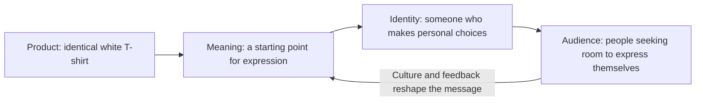

# Chapter 2: Brand Archetypes and Meaning

A plain white T-shirt can be an everyday basic, a declaration of independence, or a blank starting point for creativity. The shirt does not have to change for its meaning to change. The photographs, language, setting, and experience around it invite us to imagine different possibilities.

Chapter 1 explored how persuasion shapes a decision. This chapter asks what kind of story makes that decision feel meaningful:

**What does the audience get to feel, imagine, or become by choosing this brand?**

“Become” describes an invitation to imagine an identity. Buying a shirt does not automatically make someone creative, brave, caring, or interesting.

## A Framework for Recognizable Meaning

**Brand archetypes are generalized cultural and narrative patterns used to organize a brand's meaning.** The guide who seeks understanding, the challenger who questions rules, and the maker who brings ideas to life are recognizable story roles. Designers can use these patterns to connect a product, organization, or experience with a coherent promise.

For example, a hypothetical tutoring center could adopt a Sage emphasis: help students understand how things work. That choice should affect its behavior, including patient explanations and transparent reasoning. A hypothetical community workshop could emphasize the Creator by helping visitors develop their own ideas. Its tools, instructions, and welcoming staff would need to support that promise.

An archetype gives a team a shared direction for choices about language, imagery, service, and storytelling. It is more useful than a vague instruction to “make the brand exciting” because it asks what kind of excitement serves the audience.

Margaret Mark and Carol S. Pearson applied a twelve-archetype framework to branding in *The Hero and the Outlaw*. Pearson's [description of the book](https://carolspearson.com/books-page/the-hero-and-the-outlaw-building-extraordinary-brands-through-the-power-of-archetypes) connects this approach with organizational culture and identity. Treat the framework here as a design tool, not a personality diagnosis or an exhaustive map of human motives.

## Twelve Common Archetypes

The following is a practical set of common branding labels. Some versions use **Outlaw** for Rebel or **Regular Person** for Everyperson. The short meanings summarize the framework; the audience invitations and cautions are teaching examples, not predictions about every buyer.

| Archetype | Central meaning | What the audience might get to feel or imagine | Risk to watch for |
| --- | --- | --- | --- |
| Explorer | Freedom and discovery | Permission to try an unfamiliar direction. | Treating places or communities as scenery for someone else's adventure. |
| Sage | Knowledge and understanding | Confidence in making an informed choice. | Sounding superior or presenting uncertainty as settled fact. |
| Creator | Imagination and making | Space to express an original idea. | Implying that people need a purchase to be creative. |
| Ruler | Order and leadership | Composure, control, and high standards. | Equating status with human worth. |
| Caregiver | Care and support | Reassurance that needs will be taken seriously. | Using guilt or making promises of care the organization cannot keep. |
| Rebel | Challenge and liberation | Freedom to question an expectation. | Selling empty defiance or encouraging harm. |
| Hero | Courage and mastery | Motivation to face a difficult task. | Shaming people who need rest or assistance. |
| Everyperson | Belonging and equality | Ease without needing to impress anyone. | Defining “ordinary people” so narrowly that others feel excluded. |
| Innocent | Hope and simplicity | Relief from unnecessary complication. | Confusing reassuring presentation with proof of safety or purity. |
| Jester | Play and enjoyment | Permission to be spontaneous or silly. | Making the audience, rather than the situation, the joke. |
| Lover | Connection and appreciation | A sense of closeness, beauty, or being valued. | Exploiting insecurity or promising acceptance through appearance. |
| Magician | Transformation and possibility | Wonder at seeing a new possibility emerge. | Promising changes the product cannot deliver. |

These labels help compare directions. They do not require a costume: an Explorer brand does not always need mountains, and a Sage brand does not always need books or academic language.

## From Product to Audience

An archetype helps connect what someone buys with what that choice might mean to them. Here is one possible Creator interpretation of the shirt:

The diagram represents a proposed relationship, not an automatic psychological process. Start your actual design work by listening to the audience. Some people may welcome the invitation; others may see only a shirt they need for work. They help determine the meaning, too.

## One Shirt, Four Dramatically Different Positions

For this exercise, keep the fabric, cut, color, stitching, price, and purchase terms identical. Do not print anything on the shirt or claim improved performance. Change only its presentation. All campaign lines below are original hypothetical examples, not quotations from existing brands.

### Creator: An Invitation to Make

**Sample campaign line:** Start with a blank.

Photograph the shirt beside sketchbooks and different outfit combinations. Use a layout that feels like a working notebook, with room for possibilities. Show several ways to style the same shirt without altering it.

The audience gets to imagine being the author of their own appearance. The brand supplies a starting point; the wearer supplies the idea. This positioning needs to leave room for actual choice, rather than declaring one supposedly correct creative look.

### Rebel: An Invitation to Refuse the Script

**Sample campaign line:** You don't owe anyone a dress code.

Use blunt typography and photographs that contrast the plain shirt with an elaborate staged fashion display. Keep the visual emphasis on choosing simplicity in the face of pressure to impress.

The audience gets to imagine independence from other people's expectations. This is a symbolic invitation, not permission to ignore safety requirements or a promise that wearing the shirt changes institutions. Do not invent an activist history or suggest that other clothing choices make someone less authentic.

### Caregiver: An Invitation to Feel Supported

**Sample campaign line:** One less thing to figure out.

Show the shirt as part of an ordinary morning. Pair calm photographs with readable sizing information and clear instructions. Use patient, welcoming language that makes choosing feel manageable.

The audience gets to imagine a little relief in a busy day. The promise should be supported by helpful service. Warm imagery alone cannot establish that the shirt is softer, healthier, or more responsibly manufactured than it was in the other campaigns.

### Ruler: An Invitation to Feel Composed

**Sample campaign line:** Set your own standard.

Place the identical shirt in a carefully ordered composition, with precise spacing and restrained language. Show it as part of an intentional wardrobe rather than a hurried decision.

The audience gets to imagine control and composure. The polished presentation does not prove superior construction or justify claims of exclusivity. It should not imply that people wearing other shirts are inferior.

The contrast is substantial: a starting point, an act of refusal, a reassuring choice, or a symbol of control. None requires a different shirt. Each proposes a different answer to why someone might care about it.

## Archetypes Are Not Destiny

A person may seek adventure on a weekend, dependable care during a difficult week, and expert guidance when studying. That person is not permanently an Explorer, Caregiver, or Sage. Buying behavior also reflects practical constraints such as price, fit, and availability.

A brand can contain multiple tendencies. A Creator emphasis might be supported by Sage-like instructions that help people learn. Choose a leading meaning for a particular communication, then use supporting tendencies where they make sense. For the shirt, “a starting point for expression” and clear styling explanations can work together. A message that demands obedience while celebrating total independence needs more thought.

**Cultural context matters.** A story of individual rebellion may feel liberating to one audience and self-centered to another. A formal composition may suggest reassurance to some viewers and social exclusion to others. Even white clothing may carry associations the designer did not intend. Investigate those associations with the intended audience rather than assuming your interpretation travels everywhere.

Do not turn archetypes into stereotypes about gender, nationality, age, or class. Caregiving is not a female personality category; leadership is not a male one. People can also enjoy a story without wanting it to define them.

Use the framework as a hypothesis: “We think this presentation will communicate room for personal expression.” Then ask people what they actually notice and infer. If their interpretation differs, revise the presentation or the underlying idea.

## Questions to Ask When Choosing an Archetype

1. What does the audience get to feel, imagine, or become by choosing this brand?
2. What audience need does that invitation serve beyond our desire to sell?
3. Which product qualities and organizational behaviors support the promise?
4. What is the leading meaning, and do any supporting archetypes clarify it?
5. How might cultural context change the interpretation? Whose perspective is missing?
6. Are we inviting an identity or pressuring people to prove their worth through a purchase?
7. Do the words, images, and service communicate the same promise?
8. What would we ask audience members to learn whether the intended meaning comes through?

For the shirt, a useful audience question is: “What kind of experience would you expect from this brand, and what in the presentation gives you that impression?” This invites an explanation instead of asking someone to confirm your chosen label.

## What You Should Remember

- Archetypes organize recognizable meanings for products, organizations, and experiences. They are not rigid personality categories.
- Ask what the audience is invited to feel, imagine, or become, then connect that invitation to something the brand can deliver.
- The identical white T-shirt can suggest creativity, rebellion, care, or control through different presentations.
- People and brands can contain several tendencies, and cultural context changes how stories are understood.
- Use archetypes to guide choices, listen to the audience, and revise. A compelling story still needs honest claims and credible behavior.
