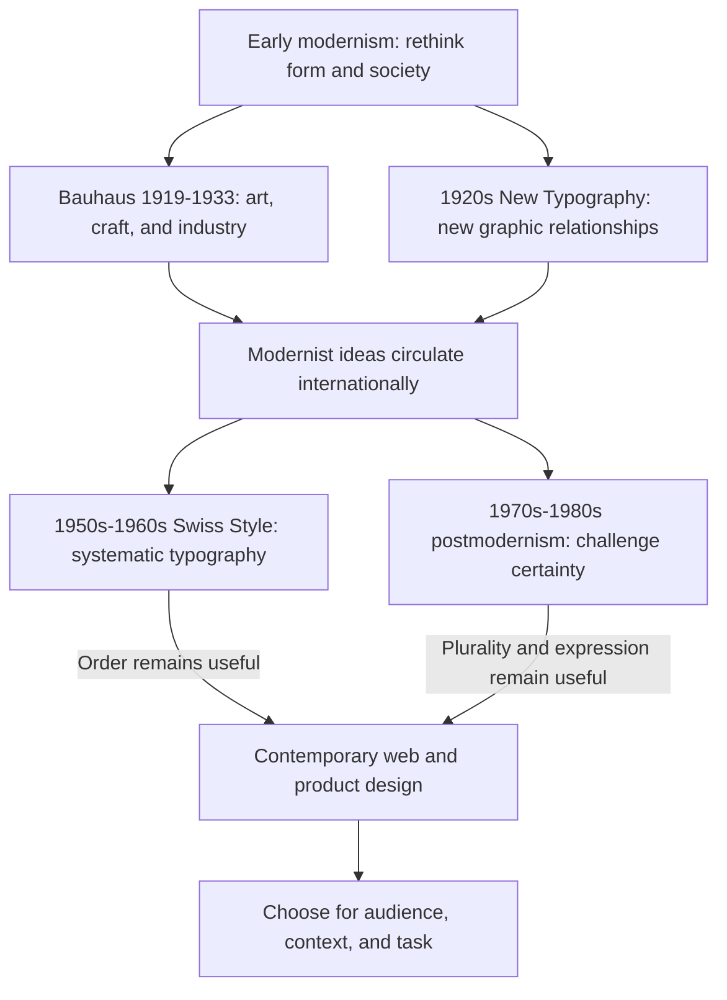

# Chapter 3: How Visual Design Carries Ideas

Before you read a headline, its design has already offered clues. Precisely aligned text might suggest competence. Overlapping letters might suggest urgency, play, or disagreement. Neither interpretation is automatic: your experience and the setting affect what you see.

**Visual design language is the way typography, images, color, space, materials, and arrangement work together to communicate.** It helps establish what matters, how to approach it, and what kind of relationship the maker wants with the audience.

To understand these choices, it helps to know something about the arguments behind them. Modernism and postmodernism offer a particularly useful history of competing ideas about order, progress, identity, and expression. They are broad, internally varied traditions, not two boxes into which every design must fit.

## Early Modernism: Design for a Changing World

In the early twentieth century, designers faced industrial production, new technologies, and enormous social change. Modernism gathered different efforts to rethink how people lived and how objects communicated. Especially between the world wars, many designers connected practical, reproducible forms with hopes for a better society. They questioned inherited decoration and looked toward materials, machines, and everyday needs. The V&A's [introduction to modernism](https://www.vam.ac.uk/articles/what-was-modernism) explains these ambitions.

Graphic design participated in this change. The New Typography of the 1920s explored asymmetry and new relationships between type, photographs, and space. Jan Tschichold organized its principles in *Die Neue Typographie* in 1928, drawing on developments including Soviet design and the Bauhaus. See [MoMA's account of the New Typography](https://www.moma.org/calendar/exhibitions/1013).

This matters because modernism itself disrupted conventions. Its later association with professional order can obscure how unfamiliar its experiments once looked. The historical question was larger than which layout looked tidy: could new forms help build a new way of living?

## Bauhaus: Learning Through Making

Walter Gropius founded the Bauhaus in Weimar, Germany, in 1919. The school initially emphasized craft and later placed greater emphasis on art, technology, and industrial production. It moved to Dessau and then Berlin, ending in 1933 under Nazi pressure. Its influence continued through the work and teaching of people who moved abroad. The V&A describes this development in [its Bauhaus overview](https://www.vam.ac.uk/articles/modernist-architecture-the-bauhaus-and-beyond); MoMA also summarizes [the school's locations and ambitions](https://production-gcp.moma.org/calendar/galleries/5388).

Think of the Bauhaus as a changing educational experiment, rather than a recipe involving three primary colors and geometric shapes. Its work connected artistic decisions with the making of useful things.

For a student designer, a useful question inspired by that approach is: **What does this form help the object or message do?** In a hypothetical product label, a strong contrast between the product name and care instructions can help people locate different kinds of information. Decoration and construction deserve deliberate choices, not automatic acceptance or rejection.

## Swiss / International Typographic Style: Making Relationships Clear

After the Second World War, Swiss designers developed an influential approach associated with schools in Zurich and Basel. Particularly prominent in the 1950s and 1960s, the Swiss or International Typographic Style emphasized precise typography, grids, sans-serif lettering, photography, and carefully structured compositions. The [Swiss National Library's historical overview](https://www.nb.admin.ch/en/the-international-style-1950-1970) describes these characteristics.

Here are five practical terms for understanding that visual system:

- **Grid:** An underlying set of alignments, columns, or modules that relates elements to one another.
- **Hierarchy:** Differences in size, weight, position, or spacing that suggest a reading order.
- **Clarity:** Making the message and its relationships understandable to an intended audience.
- **Reduction:** Removing elements that do not contribute enough to the communication.
- **Function:** The task the design helps someone accomplish.

Imagine a hypothetical event poster. The event name is largest, the date is next, and location details share a consistent alignment. The grid supports a quick comparison of information. It need not make everything centered, symmetrical, or equally important.

An aspiration toward broadly understandable communication is valuable. But universality is an ambition to examine, not a property guaranteed by a typeface. A tidy layout can still assume a particular language, reading direction, level of vision, or familiarity with symbols. Ask who actually finds it clear.

## Postmodernism: Questioning the Single Right Answer

Postmodern design gained particular prominence during the 1970s and 1980s. Part of its energy came from challenging modernist confidence in progress, purity, and a single rational order. Designers made room for plurality: different histories, voices, tastes, and interpretations. The V&A's [account of postmodernism](https://www.vam.ac.uk/articles/what-is-postmodernism) describes its complexity, theatricality, and contradictions.

**Quotation** means borrowing a recognizable visual language from another context or period. **Irony** introduces a gap between a design's surface statement and what it invites you to understand. Expressive typography, unexpected mixtures, and disrupted alignments can make the construction of a message visible.

As a hypothetical example, a poster might place an everyday object inside an exaggerated imitation of a formal portrait frame. The joke could question what deserves prestige. Whether that joke works depends on the audience recognizing the reference.

Postmodernism was more than adding decoration, and modernism was more than removing it. Both could experiment; neither guarantees good judgment. A challenging design can reward attention, but obscurity alone does not make it thoughtful.

## A History of Overlapping Arguments

This concept map traces one route through the history, not an exhaustive family tree. The dates mark important periods, not boundaries after which earlier ideas vanished.

## Six Tensions to Design With

The table compares tendencies and offers hypothetical digital applications. These are questions to balance, not a checklist for identifying a historical movement.

| Tension | What the first emphasis offers | What the second emphasis offers | A practical design decision |
| --- | --- | --- | --- |
| Order and disruption | Predictable relationships. | A deliberate interruption that attracts attention. | Keep navigation stable while letting a campaign headline break the usual rhythm. |
| Universality and identity | Shared conventions that support familiarity. | A voice connected to a particular community or setting. | Use recognizable controls alongside language and imagery developed with the intended audience. |
| Clarity and expression | Quick understanding. | Mood, personality, and emotional texture. | Make a festival title expressive while keeping dates and ticket details easy to read. |
| Grid and anti-grid | Consistent alignment and comparison. | Apparent departures from alignment that create tension. | Let artwork overlap its frame while preserving the reading order of essential information. |
| Restraint and abundance | Fewer competing signals. | Richness, layering, and variety. | Use a dense visual collage for discovery and a quieter panel for selecting options. |
| Function and irony | Direct support for a task. | Humor or commentary about the task or object. | Put a playful idea in a product story while keeping payment instructions literal. |

An anti-grid composition may still depend on careful underlying structure. Likewise, restraint can express an identity, and expressive design can be clear. These tensions are productive precisely because the terms can coexist.

## The Argument Continues on Screens

Contemporary web and product design provides opportunities to combine these approaches. Consider three hypothetical interfaces:

- **A course dashboard:** Consistent columns, headings, and due-date positions help a student compare assignments. The design question is whether the structure makes the next task apparent.
- **A music event website:** Layered images and animated lettering could express the event's character. Essential dates, navigation, and ticket controls still need to remain understandable.
- **A shopping experience:** A campaign page can be visually exuberant while the size selector and checkout remain predictable. Different parts of one experience can have different expressive jobs.

These are present-day applications of the chapter's ideas, not claims that each interface belongs to a historical movement. A minimalist page might be confusing if it hides labels. A colorful page might be straightforward if its hierarchy is strong.

Responsive screens also make the grid a flexible system rather than one fixed arrangement. Overlaps that look intentional on a large display can obscure information on a small one. Consider keyboard access, readable contrast, text enlargement, and motion sensitivity alongside visual expression. Accessibility belongs in either approach.

History has not ended with one winning style. The useful question remains: which combination helps these people understand, feel, and act in this situation?

## The Same White T-Shirt, Two Presentations

Keep the shirt's fabric, cut, price, and purchase terms unchanged. These are hypothetical presentations of the exact same product.

**A modernist presentation:** Place a straightforward photograph on a clear grid. Use restrained color, consistent typography, generous space, and an obvious hierarchy for the name, measurements, and price. The shirt might feel dependable, considered, and useful. Simplicity becomes part of its appeal.

**A postmodern presentation:** Repeat the same shirt photograph in a collage, mix contrasting lettering styles, and surround it with a deliberately theatrical frame. An original campaign line such as “A very dramatic introduction to a very ordinary shirt” could make the presentation comment on advertising itself. The shirt might feel playful, culturally knowing, or open to personal interpretation.

Keep factual information legible in both. The orderly version does not prove better construction; the ironic version does not prove greater individuality. Presentation changes the invitation to interpret the shirt, not its physical properties.

## How to Read a Design

Begin with observation before assigning a style label.

1. **Identify the situation.** Who made this, for whom, and for what task? Separate facts supplied by a source from your guesses.
2. **Trace your attention.** What do you see first, second, and third? Point to size, contrast, placement, or motion as evidence.
3. **Find the structure.** Look for shared edges, repeated spacing, columns, and deliberate departures from them.
4. **Read the voice.** What do type, color, imagery, and empty space suggest? Explain which visible details support your interpretation.
5. **Look for references.** Does the work borrow another period's or community's visual language? Verify unfamiliar references instead of guessing.
6. **Ask whose needs it serves.** What cultural knowledge or physical abilities does it assume? What information is easy or difficult to find?
7. **Consider an alternative.** What would change if the layout were quieter, denser, more orderly, or more disruptive?

For example, “The aligned measurements make comparison easy” is a more useful observation than “This looks modern.” The first statement connects a visible choice to an effect you can discuss.

## Museum Research

The following are **suggestions for external research**. They do not assert that a particular museum owns a particular object. Find and verify actual records yourself.

Start at an institution's official website and look for its collection search, archive catalog, or research resources. You can also search the institution's full name together with the terms below, then confirm that the result belongs to the institution.

| Institution or collection | Search terms to try |
| --- | --- |
| The Metropolitan Museum of Art | `Bauhaus`, `modernist design`, `Marianne Brandt` |
| Museum of Modern Art (MoMA) | `New Typography`, `Jan Tschichold`, `Herbert Bayer` |
| Cooper Hewitt, Smithsonian Design Museum | `Swiss poster`, `typography`, `Wolfgang Weingart` |
| Victoria and Albert Museum (V&A) | `postmodernism`, `Memphis`, `graphic design` |
| Bauhaus-Archiv or Stiftung Bauhaus Dessau | `workshop`, `typography`, `Bauhaus teaching` |
| Swiss National Library | `International Typographic Style`, `Armin Hofmann`, `poster collection` |

Search availability and catalog vocabulary vary. If a phrase finds nothing, try a maker's name or a broader object type such as `poster`, `textile`, or `chair`. An exhibition essay can supply context, but it is not a substitute for an individual object record.

Choose two or three verified examples that let you compare different approaches. For each one:

- Record the exact title, credited maker, date, medium, institution, and accession or inventory number when provided. Keep qualifiers such as “attributed to” and approximate dates.
- Save the actual record URL and your access date. Do not construct a URL from an assumed title.
- Check whether the date refers to design, manufacture, or a later reproduction, and whether the object is owned, borrowed, or merely discussed.
- Describe visible evidence before assigning a movement. Distinguish the institution's classification from your own interpretation.
- Check image-use permissions before reproducing an image. A collection record does not automatically grant unrestricted reuse.

Then compare one specific relationship: perhaps how two posters use alignment, how two objects treat ornament, or how typography supports or disrupts reading. A careful comparison of real evidence teaches more than attaching labels to unfamiliar images.

## What You Should Remember

- Visual design carries ideas through arrangement, typography, imagery, color, and space.
- Early modernism, the Bauhaus, and Swiss typography developed different approaches to reshaping life and communication through design.
- Postmodernism challenged modernist certainty and opened space for multiple voices, quotation, irony, and disruption.
- Order and expression continue to interact in contemporary design. Choose their balance for the audience and task.
- The same shirt can feel different through presentation, but its factual qualities remain unchanged.
- Read designs through visible evidence and verify historical examples in authentic institutional records.
