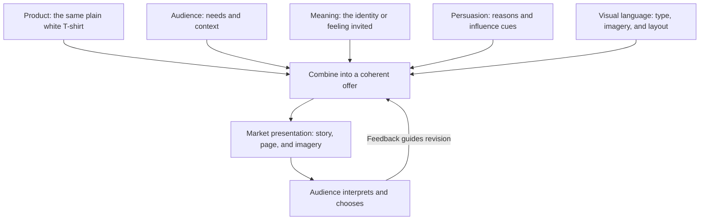

# Chapter 4: One Shirt, Four Different Invitations

Put an ordinary high-quality plain white T-shirt on a table. Give four design teams the same photograph and the same product details. One team sends it on a small adventure. Another gives it the precision of a technical manual. A third stages a rebellion against fashion advertising. The fourth lets it sleep in.

The shirt has had a busy morning without moving.

This case study brings together the previous chapters: persuasion guides attention and choice, archetypes propose a meaningful story, and visual language makes that story visible. The central question is what the customer is being invited to imagine beyond owning a useful piece of clothing.

## The Product Stays Put

For this fictional exercise, every presentation sells the **same ordinary, high-quality plain white T-shirt**. Assume these invented product specifications:

- White cotton jersey, a crew neck, a regular fit, and neatly finished seams.
- No printed graphics, special treatments, or performance technology.
- The same size range, care instructions, and product measurements.
- A price of $25, with identical stock, delivery charges, and return terms.

The quality is part of our imaginary brief, not a verified claim about a real manufacturer. Nothing here establishes organic certification, labor conditions, environmental benefits, or unusually long wear. A real campaign would need evidence for any such claims.

All concept names, headlines, and stories below are original hypothetical campaign material. No customer testimonials, endorsements, or sales figures are being claimed. We change the presentation, not the shirt or the deal.

## Concept 1: Detour

### Headline: Take the next unfamiliar turn.

**Audience:** People who want more small discoveries in their routines, including students exploring a new campus or neighborhood. Adventure here does not require a plane ticket.

**Chosen brand archetype:** Explorer. The invitation is curiosity and self-direction.

**Persuasion principles:** Framing presents an everyday basic as a companion to exploration. Commitment and consistency can connect the message to a goal the audience has freely chosen, such as making time to explore. The invitation should still work if someone wears a shirt they already own.

**Visual-design language:** An editorial travel-journal approach: generous landscape crops, small route-like marks, conversational captions, and an open, asymmetrical layout. Keep product information in a stable, readable panel.

**Short product story:**

Your afternoon does not need an itinerary. Start with a familiar shirt and leave room for something unfamiliar: another street, another bookshop, another place to sit. Detour is a plain white tee for the part of your day you have not planned yet.

**Imagery direction:** Photograph the identical shirt on someone walking through an everyday setting, pausing at a street corner or opening a notebook. Use curiosity rather than athletic achievement as the subject. Avoid mountain-rescue scenes or extreme-weather imagery that would imply technical capabilities.

**Meaning the customer is invited to buy:** Permission to see themselves as curious and independent. The shirt becomes a quiet companion to possibility.

**Ethical concern or possible misuse:** The campaign could imply that freedom requires shopping or expensive travel. It could also treat other communities as scenery. Keep exploration accessible, represent places respectfully, and make no performance claims. Buying Detour does not make someone adventurous; taking an interest in the world might.

## Concept 2: Plainly

### Headline: A shirt. Clearly explained.

**Audience:** People who dislike shopping guesswork and want to compare fit, price, and construction without decoding lifestyle promises.

**Chosen brand archetype:** Sage. Understanding is the appeal.

**Persuasion principles:** Framing presents the purchase as an informed, manageable decision. A possible authority element would be a qualified textile specialist explaining construction, but it belongs in a real campaign only after an actual review, with credentials and any payment disclosed. Clear typography alone is not expert evidence.

**Visual-design language:** Restrained modernist / Swiss-influenced design. Use a consistent grid, sans-serif typography, strong hierarchy, restrained color, and plenty of space. Align the photograph, price, measurements, and care information so they can be compared easily.

**Short product story:**

Here is the shirt. Here is how it fits. Here is what it costs. Plainly puts the details where you can find them, so you can decide whether a white crew-neck tee belongs in your wardrobe. No secret identity required.

**Imagery direction:** Use evenly lit front and back photographs, a close view of the seam, and a measurement illustration based on the actual garment. Do not invent measurement values for this exercise. Avoid white coats, laboratory props, and unofficial certification seals.

**Meaning the customer is invited to buy:** Confidence in their own judgment and relief from uncertainty. The customer gets to feel informed, not merely impressed.

**Ethical concern or possible misuse:** Precision can create an impression of objectivity that the evidence does not deserve. A beautiful chart with unsupported numbers remains unsupported. Include relevant limitations, explain measurements, and do not disguise advertising as independent evaluation.

## Concept 3: Unimpressed

### Headline: Now with absolutely no logo.

**Audience:** People who enjoy visual jokes and questioning the pressure to announce an identity through brands. They may like fashion while also finding its rituals funny.

**Chosen brand archetype:** Rebel, supported by Jester. Challenge supplies the point; humor supplies the tone.

**Persuasion principles:** Framing turns the absence of a logo into an expressive choice. Liking may develop through a humorous voice that shares the audience's irritation with exaggerated advertising. Enjoying the joke should not be mistaken for proof of product quality.

**Visual-design language:** Disruptive and postmodern. Use oversized competing type, collage, deliberately mismatched frames, and a mock-grand unveiling of an extremely ordinary garment. Let the campaign question its own importance. Keep essential shopping controls and facts easy to read.

**Short product story:**

We considered adding a symbol of your unique individuality. Then we remembered you already have that. Unimpressed is a plain white T-shirt with nothing printed on it. Wear it however you like. It has no speech prepared.

**Imagery direction:** Place the shirt on a theatrically lit pedestal. Surround its photograph with exaggerated arrows pointing toward the lack of a logo. The arrows and collage belong to the advertisement, not the garment. Include an unobstructed product image so the joke does not hide what is for sale.

**Meaning the customer is invited to buy:** The pleasure of feeling independent and in on the joke. The brand sells a knowing distance from branding, which is itself a branding strategy.

**Ethical concern or possible misuse:** Anti-consumerist humor can become another pressure to consume. Avoid suggesting that buyers are smarter than people who enjoy logos. Do not invent activist credentials, and do not use irony to excuse misleading prices or obstructive navigation. The joke should survive someone choosing not to buy.

## Concept 4: Soft Landing

### Headline: One less decision before breakfast.

**Audience:** People managing busy schedules who want an easy clothing option and a calm shopping experience. This could include a student balancing classes, work, and family responsibilities.

**Chosen brand archetype:** Caregiver. The invitation is consideration and everyday support.

**Persuasion principles:** Framing places the shirt within a manageable morning routine. Reciprocity could come from a freely available clothing-care guide that offers useful help before asking for a sale. Provide it without requiring an email address or treating the reader as indebted.

**Visual-design language:** Warm, approachable, and domestic: a gentle color palette around the white shirt, readable type, simple illustrations, and relaxed spacing. Clear organization supports the mood without making the experience feel clinical.

**Short product story:**

Some mornings already have enough tabs open. Soft Landing offers a straightforward place to start: a plain white tee, clear sizing, and the details you need without a scavenger hunt. Get dressed. Make breakfast. Let the shirt be the easy part.

**Imagery direction:** Photograph the same shirt beside an ordinary chair or folded with other everyday clothes. Show unhurried moments in believable rooms. Preserve accurate fabric detail and color; do not edit the garment to suggest greater softness than the other presentations.

**Meaning the customer is invited to buy:** A small sense of relief and being considered. The shirt is framed as one manageable choice within a demanding day.

**Ethical concern or possible misuse:** Caring language can exploit exhaustion or imply therapeutic benefits. The name does not establish exceptional fabric softness. Avoid promises to reduce anxiety, and support the caring tone with useful information and respectful service. Warm photographs cannot compensate for an unhelpful experience.

## Compare the Four Invitations

The persuasion column summarizes proposed approaches. Conditional evidence, such as Plainly's specialist review, must exist before it appears in an actual campaign.

| Concept | Audience need | Archetype | Persuasion approach | Visual language | Meaning offered | Main ethical risk |
| --- | --- | --- | --- | --- | --- | --- |
| Detour | Discovery within everyday life | Explorer | Framing; voluntary commitment and consistency | Open travel-journal composition | I can follow my curiosity. | Equating freedom with consumption or implying outdoor performance. |
| Plainly | Enough information to decide | Sage | Framing; authority only with verified expertise | Restrained modernist / Swiss grid | I can make an informed choice. | Letting visual precision impersonate evidence. |
| Unimpressed | Expression without solemn branding | Rebel / Jester | Framing; liking through humor | Postmodern collage and disruption | I can question the script. | Selling conformity disguised as independence. |
| Soft Landing | A manageable everyday choice | Caregiver | Framing; reciprocity through optional help | Warm imagery and calm hierarchy | My needs deserve consideration. | Exploiting stress or suggesting unsupported benefits. |

## How the Presentation Comes Together

The components have different jobs. Audience identifies whose situation matters; meaning proposes why the shirt might matter; persuasion shapes the invitation; visual language gives it a visible form. The physical product remains the anchor.

This is not a formula that guarantees sales. Someone may appreciate Unimpressed's joke and buy Plainly because its sizing is easier to understand. Another person may like all four and need none of them.

## Give the Concepts a Reality Check

Ask a classmate to compare the presentations without first showing them the archetype labels. What kind of person or situation does each seem to address? What qualities do they assume the shirt has? Which specific words or images led them there?

If they infer that Detour is moisture-wicking or that Soft Landing uses a different fabric, the presentation has changed their understanding of the product facts. Revise it. A successful shift in meaning should not depend on an accidental false claim.

Then switch two headlines. Put Plainly's direct explanation on Unimpressed's theatrical pedestal. Does the contradiction create a useful joke, or does it muddy the message? The exercise helps reveal how words and images work together rather than serving as interchangeable decorations.

Finally, ask whether the audience can find the full cost, assess fit, and decline without pressure. An entertaining campaign still has a practical job to do.

## What You Should Remember

- One physical shirt can support very different presentations without acquiring different physical qualities.
- Audience, archetype, persuasion, and visual language should work together around a meaningful invitation.
- Explorer, Sage, Rebel, and Caregiver stories offer different ways to imagine the same purchase.
- Both restrained grids and disruptive collage can communicate effectively when facts and essential actions remain clear.
- An appealing identity is not evidence of performance, expertise, or ethical production.
- Let audience feedback reveal unintended claims, and leave room for the perfectly reasonable decision not to buy another shirt.
