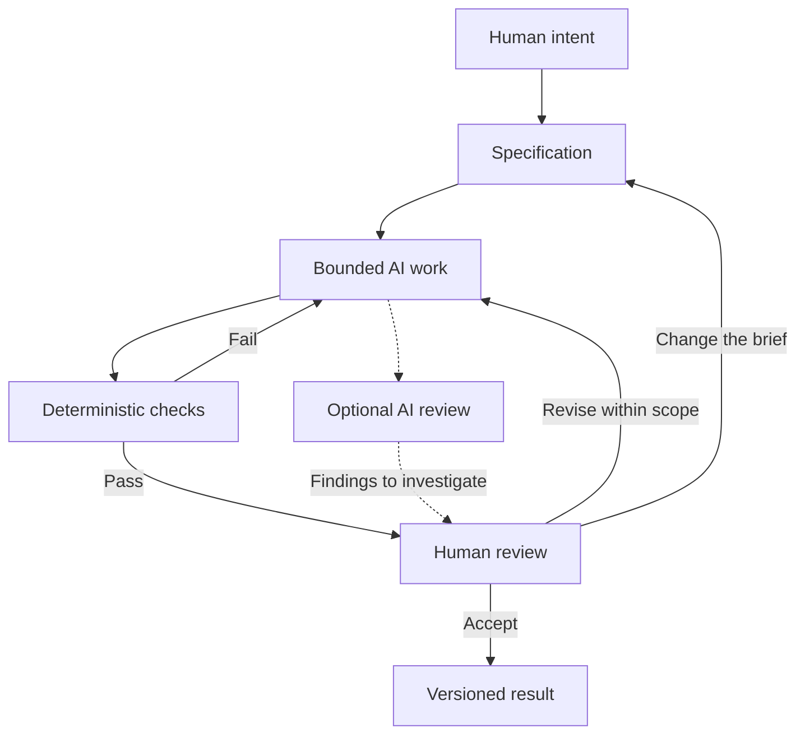

# Chapter 5: Directing the Work, Keeping the Judgment

Our plain white T-shirt has now been an invitation to explore, a clearly explained basic, a joke about branding, and a small promise of everyday relief. Its fabric never needed to change. What changed was the relationship proposed between the product and its audience.

That gives us more than a way to discuss advertising. It gives us a practical framework for directing AI-assisted creative and technical work. Before asking an AI to produce something, decide what the work is meant to accomplish, what it should mean, and how that meaning should appear.

## Three Lenses, One Direction

| Lens | Guiding question | Example for the white T-shirt |
| --- | --- | --- |
| Persuasion | What response are we trying to enable? | Help someone compare fit and price and decide whether the shirt meets their needs. |
| Archetype | What meaning or identity are we expressing? | Use a Sage emphasis to invite informed, independent judgment. |
| Design language | How should that meaning look and feel? | Use a restrained grid, clear hierarchy, readable type, and straightforward photographs. |

Together, these lenses form a **high-level control framework**: a way to state priorities and evaluate whether the result follows them. They do not precisely control an AI's output, and they do not replace product facts or technical requirements.

Compare “make a great product page” with “help a first-time buyer evaluate this shirt, express a Sage emphasis through clear explanations, and use a restrained visual hierarchy.” The second direction gives the AI, and its human reviewer, something concrete to work toward.

The lenses can also reveal contradictions. A page that promises informed choice but hides the full cost has a persuasion problem. A caring voice paired with an obstructive return process has a meaning problem. Tiny pale labels have a readability problem even if the page looks impressively minimal.

## Turn Direction into a Bounded Specification

AI can generate plausible material beyond what you intended. A specification establishes what belongs in the task, what evidence is available, and what completion means. It reduces guessing and makes the result small enough to review.

A useful specification identifies:

- **Purpose and audience:** Who needs the output, and what should it help them do?
- **Required artifact:** Which file or component should be created or changed?
- **Creative direction:** What response, meaning, and visual language should guide it?
- **Facts and constraints:** What must remain true, and what must not be invented?
- **Acceptance criteria:** What observable properties must the result contain?
- **Review boundary:** What needs human judgment before the result is accepted?

Here is a hypothetical brief for a later exercise. It is an example, not an instruction to create another file now.

> Create one Markdown brief for a white T-shirt product page. Help readers assess suitability rather than pressure them to buy. Use a Sage emphasis and a restrained Swiss-influenced hierarchy. Keep the supplied product facts, price, and terms unchanged. Include a headline, short story, information order, imagery direction, and ethical caution. Do not invent reviews, certifications, measurements, or specialist endorsements. Change only the designated brief file. Flag missing information for human review.

For a technical task, add the intended behavior: what a control does, how errors are handled, and which existing interfaces must remain compatible. “Make it feel trustworthy” cannot specify what happens when a size is unavailable.

A bounded task can still be creative. The boundary defines the problem; it leaves room for different good solutions inside it. If the work needs a larger scope, revise the specification deliberately rather than letting the task expand unnoticed.

## Different Checks Answer Different Questions

Validation works best when each method has a clear job.

| Method | Useful question | Example | Important limit |
| --- | --- | --- | --- |
| Deterministic automated check | Does the output satisfy an explicit rule? | Confirm that required chapter files exist and local chapter links resolve. | A file can exist and still contain poor reasoning. |
| AI review | What possible problems deserve attention? | Flag a product story that may imply unsupported environmental benefits. | The review can miss a problem or confidently invent one. |
| Human review | Is this appropriate, truthful, and worth accepting? | Decide whether the campaign respects its audience and accurately represents the product. | Review requires attention, evidence, and sometimes outside expertise. |

**Deterministic checks** apply defined rules. With the same inputs and controlled conditions, they produce the same result. Once set up, they are useful for cheap, repeatable validation: required headings, allowed file changes, local links, or a parser's ability to read Mermaid syntax. For application code, checks can cover specified behavior and catch regressions.

These are recommended checks for a suitable workflow, not a claim that they have been run on this guide. Choose checks that match the specification. A passing heading check does not establish historical accuracy; a diagram that parses can still communicate a mistaken idea.

**AI review is probabilistic:** its conclusions can vary and can be wrong. Even a repeatable response is not automatically correct. Ask it to identify the relevant passage, explain the possible problem, and distinguish evidence from inference. Treat its output as review leads to investigate. Having an AI approve another AI's work does not turn approval into proof.

## Git: A Record You Can Inspect and Recover

Git records versions of files through commits. A diff shows what changed between versions, which makes an AI-generated edit easier to inspect. A focused commit with a useful message, and an issue reference when applicable, connects the result with the task that motivated it.

A branch provides a separate line of work so a change can be reviewed before integration. Earlier committed versions provide recovery points: you can retrieve previous content or make a new commit that reverses a change. Git cannot recover every edit that was never recorded, and local version history is not a substitute for a separate backup.

For the shirt brief, imagine that a revision adds “ethically manufactured” without evidence. A diff helps you see that addition. You can remove it before acceptance or correct a version already committed. The history helps trace the change; it does not establish whether the original claim was true.

Record the purpose of a change, not just that an AI generated it. “Clarify sizing information for first-time buyers” tells a future reader more than “AI update.” In this learning exercise, the student reviews and commits the result.

## Human Review Is a Pit Stop

A race car does not stop after every turn, but it also does not finish safely because everyone ignores the tires. Selected stops let the crew inspect conditions and make decisions that matter for the next stretch.

Think of automation in the same way. Within the agreed scope, it can keep drafting, formatting, and performing authorized routine checks. Deliberate human inspection belongs at selected moments: when the direction is first established, when evidence or scope changes, and before a result is accepted or published.

At the pit stop, inspect more than speed:

- Does the result still serve the intended audience and task?
- Can its factual claims be supported?
- Does its implied meaning match what the product or organization can deliver?
- Have cultural context, accessibility, and likely misunderstandings been considered?
- Is the change small and clear enough to accept, or does it need another revision?

The metaphor is about placing attention well. If a serious problem appears between planned stops, stop and address it. Continuing automatically is not the objective; making useful, accountable progress is.

## A Workflow That Keeps Responsibility Visible

The main path moves from intent to an accepted, recorded result. The return paths matter just as much: a failed check calls for a correction, while a misunderstood audience may require a new brief. Recheck relevant conditions after revisions.

The final node represents the accepted version, not a ban on earlier checkpoint commits. Version control can preserve intermediate work too. Human review is also part of forming the initial intent, rather than something saved entirely for the end.

Humans remain responsible for **judgment, meaning, truthfulness, context, and final decisions**. An AI can propose a headline, identify a possible contradiction, or implement a specified interaction. It cannot take responsibility for the promises an organization makes. When the evidence is missing, the responsible next step is to investigate, qualify, or remove the claim.

## Questions for Next Week

1. How would your specification change if the audience needed reassurance rather than excitement?
2. Could two different archetypes support the same useful response? What would change in the presentation?
3. Which parts of your next task can be checked with explicit rules, and which require interpretation?
4. What claim might an attractive design encourage people to believe without enough evidence?
5. Where would you place the human pit stops, and what evidence should be ready at each one?
6. What should a future reader learn from your diff and commit message?
7. What would make you reject an output that passed every automated check?

## What You Should Remember

- Persuasion directs the response, archetype directs meaning, and design language directs how that meaning looks and feels.
- A specification turns those intentions into bounded work with observable requirements.
- Deterministic checks make routine validation cheap and repeatable; AI review offers useful but fallible interpretations.
- Git makes recorded changes traceable and provides recovery points, without proving the work is correct.
- Human pit stops preserve deliberate judgment while automation handles routine work.
- People remain accountable for truthfulness, context, meaning, and the decision to accept the result.
